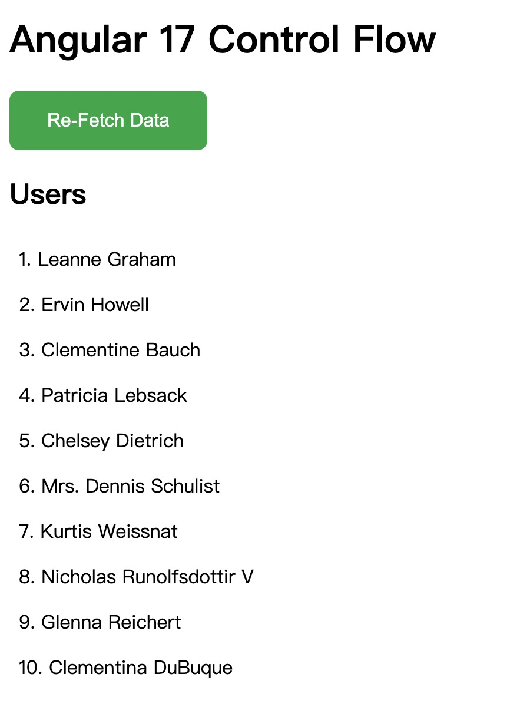
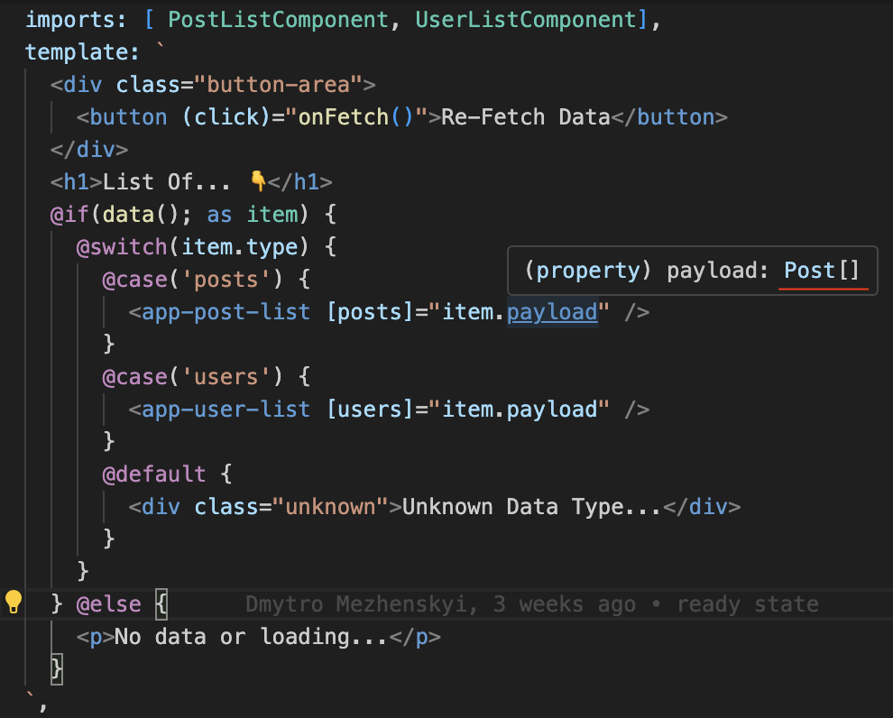

# Angular 17 中的控制流（Control Flow）

Angular 在这个月发布了 17 版本，带来了许多新的功能，其中之一就是在模板中内置了新的控制流（Control Flow）。

控制流是一种将流程控制直接写入模板的新声明性语法，从而无须使用 `*ngIf`、`*ngFor` 和 `*ngSwitch` 这种基于指令（Directive）的控制流。不知道大家有没有这种感觉，在使用基于指令的控制流时，经常会忘记具体的语法，需要反复查看文档，而新的控制流语法变得很简单，也更容易记住。

本篇文章将通过重构一个简单的项目，来展示一下如何将基于指令的控制流，转换为新的内置控制流写法。

## 项目设置

在创建项目之前，首先需要确保安装了最新版本的 Angular cli。

```bash
npm i -g @angular/cli@latest
```

之后创建一个新项目：

```bash
ng new control-flow-demo
```

我们的示例模板代码内容如下：

```ts
@Component({
  selector: 'app-root',
  standalone: true,
  imports: [PostListComponent, UserListComponent, NgIf, NgSwitch, NgSwitchCase, NgSwitchDefault],
  template: `
    <h1>Angular 17 Control Flow</h1>

    <button (click)="fetchData()">Re-Fetch Data</button>

    <ng-container *ngIf="data as item; else noData">
      <ng-container [ngSwitch]="item.type">
        <app-post-list *ngSwitchCase="'posts'" [posts]="item.payload"> </app-post-list>
        <app-user-list *ngSwitchCase="'users'" [users]="item.payload"> </app-user-list>
        <div *ngSwitchDefault class="unknown">Unknown Data Type...</div>
      </ng-container>
    </ng-container>

    <ng-template #noData>
      <div>No data or loading...</div>
    </ng-template>
  `,
  styleUrls: ['./app.component.scss'],
})
export class AppComponent implements OnInit {}
```

效果图：



在应用加载时，会随机从 `users`、`posts` 和 `photos` 中获取一种数据。点击按钮会重新随机获取（数据来自 [jsonplaceholder](https://jsonplaceholder.typicode.com/)）。在获取过程中显示 `No data or loading...`，如果获取到 users 或者 posts，会渲染出列表，否则显示 `Unknown Data Type...`。

## @if

首先让我们从替换 `*ngIf` 开始。

从模板代码中可以看到，我们使用 `*ngIf` 来判断当前是否有数据，有的话渲染对应的内容，没有的话渲染 `#noData` 模板。

```html
<ng-container *ngIf="data as item; else noData"> ... </ng-container>
<ng-template #noData>
  <div>No data or loading...</div>
</ng-template>
```

使用新的内置语法替换之后如下：

```html
@if (data; as item) {
<ng-container [ngSwitch]="item.type">
  <app-post-list *ngSwitchCase="'posts'" [posts]="item.payload"> </app-post-list>
  <app-user-list *ngSwitchCase="'users'" [users]="item.payload"> </app-user-list>
  <div *ngSwitchDefault class="unknown">Unknown Data Type...</div>
</ng-container>
} @else {
<div>No data or loading...</div>
}
```

与基于指令的 `*ngIf` 相比，有以下几个优点：

1. 可以直接使用 `@else`，不需要声明额外的模板变量。
2. 支持 `@else if` 语法，能够判断更多的情况，基于指令的写法是做不到的。
3. 新的语法无须导入 `CommonModule` 或者 `*ngIf` 指令，方便使用。

## @switch

接下来我们替换 `*ngSwitch`。

我们在模板代码中，通过获取到的数据类型，来显示不同的内容。只支持 users 或者 posts，否则渲染 `*ngSwitchDefault` 部分。

```html
<ng-container [ngSwitch]="item.type">
  <app-post-list *ngSwitchCase="'posts'" [posts]="item.payload"> </app-post-list>
  <app-user-list *ngSwitchCase="'users'" [users]="item.payload"> </app-user-list>
  <div *ngSwitchDefault class="unknown">Unknown Data Type...</div>
</ng-container>
```

使用新的内置语法替换之后写法如下：

```bash
@switch (item.type) {
  @case ('posts') {
    <app-post-list  [posts]="item.payload" />
  }
  @case('users') {
    <app-user-list  [users]="item.payload" />
  }
  @default {
    <div  class="unknown">Unknown Data Type...</div>
  }
}
```

新的语法有一个最大的优点就是可以做到类型收窄。



通过上面的图可以看到，在 `@case ('posts')` 分支下，typescript 能够推断出 `payload` 对应的类型为 `Post[]`，同理，如果我们查看 `@case('users')` 下的 `payload`，类型就是 `User[]`。这在 `*ngSwitch` 中是不可能做到的。

## @for

最后是 `*ngFor`，我们以 `app-user-list` 为例。

```ts
import { NgFor } from '@angular/common';
import { Component, Input } from '@angular/core';
import { User } from '../model';

@Component({
  selector: 'app-user-list',
  standalone: true,
  imports: [NgFor],
  template: `
    <h2>Users</h2>
    <ng-container *ngFor="let user of users; trackBy: trackByFn; let i = index">
      <span class="item">{{ i + 1 }}. {{ user.name }}</span>
    </ng-container>
  `,
})
export class UserListComponent {
  @Input() users: User[] = [];

  trackByFn(index: number, item: User) {
    return item.id;
  }
}
```

我们使用 `*ngFor` 渲染了一个 users 列表，并且提供了 `trackBy` 函数，以及将 `index` 赋值给了 `i` 变量。

新的内置语法写法如下：

```bash
@for (user of users; track user.id;) {
  <span class="item">{{ $index + 1 }}. {{ user.name }}</span>
}
```

需要注意的是，`@for` 必须提供 `track` 部分，这个对性能优化很重要，可以像上面代码一样，或者直接 `track $index` 也是可以的。

`@for` 还有个伙伴 `@empty`，我们在渲染列表时，有时候会先判断列表长度是不是为 0，这时候会用到 `@if`，比如这种写法：

```bash
@if (users.length > 0) {
  @for (user of users; track user.id;) {
    <span class="item">{{ $index + 1 }}. {{ user.name }}</span>
  }
} @else {
  <span>No Data</span>
}
```

这种情况可以使用 `@empty`，省去 `@if` 和 `@else`。

```bash
@for (user of users; track user.id;) {
  <span class="item">{{ $index + 1 }}. {{ user.name }}</span>
} @empty {
  <span>No Data</span>
}
```

## 总结

总体来说，新的内置语法与 js 语法更相似了，变得更加直观，简化了使用方式。

并且根据 Angular 团队的说法，内置控制流减少了运行时的占用空间，性能更好。

如果你的项目有升级 Angular 到最新版本的打算，那就赶快体验起来吧！
