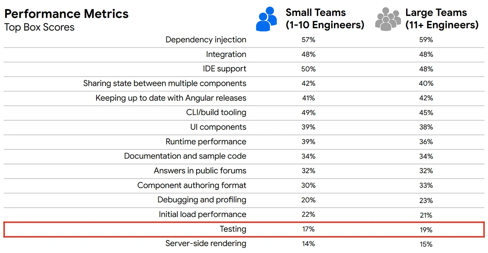
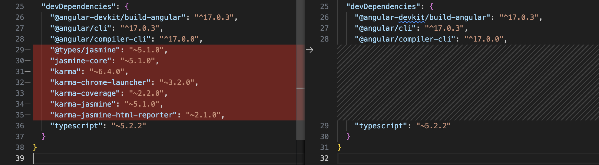
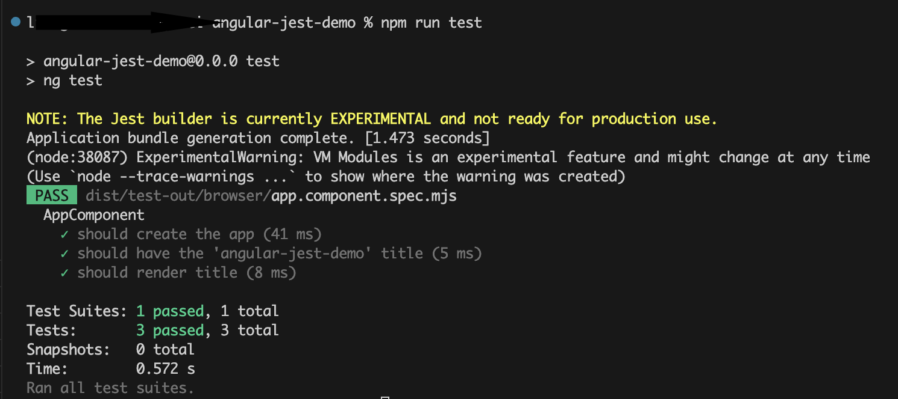
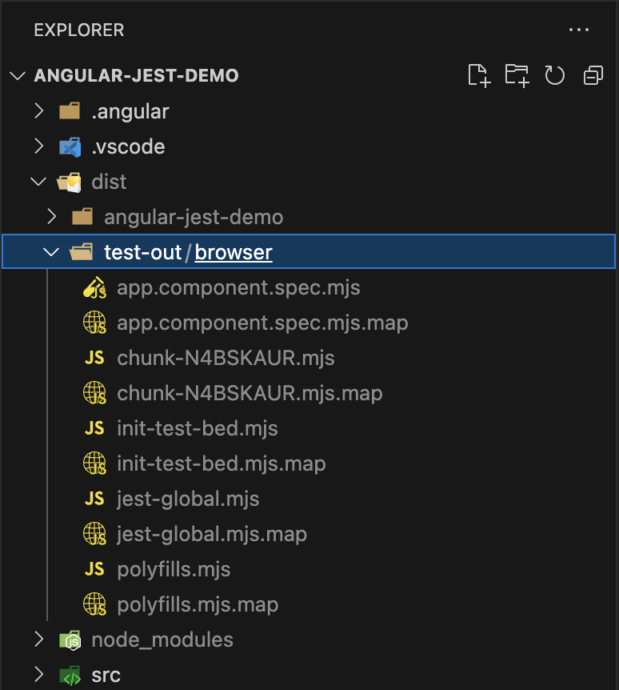
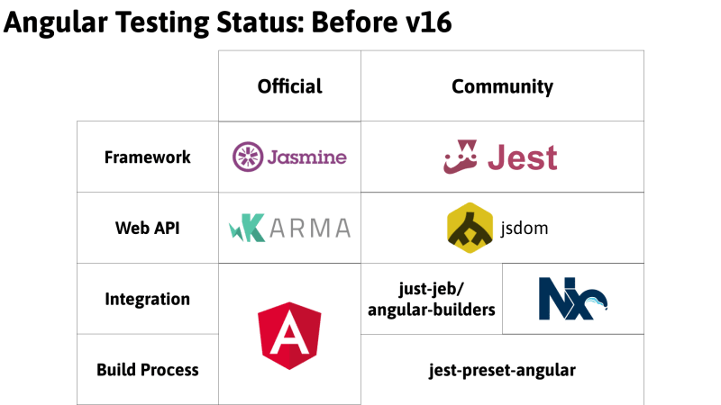
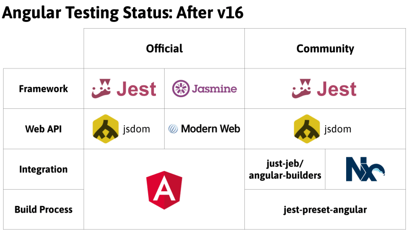

# 为什么 Angular 抛弃 Karma 去拥抱 Jest 了

良好的测试对于有效构建高度复杂且可扩展的应用程序至关重要，也是项目成功的关键。作为一个眼光卓越的框架，Angular 在设计之初就考虑了测试的能力，并向开发者提供了许多测试功能。

使用 Angular CLI 生成项目时会默认使用 Karma 作为 test runner，Jasmine 作为测试框架。但是现如今，由于 Jest 的简单性、速度以及快照测试和模拟等内置功能，不少人开始尝试使用 Jest 代替默认的 Angular 测试方案。

并且根据有关 Angular 满意度的开发人员调查结果显示，Angular 的单元测试满意度也很低。主要原因是单元测试速度慢、重量级，并且由于 Karma 利用了真正的浏览器，导致单元测试难以与 CI/CD 集成。



> 上图是有关 Angular 满意度的开发人员调查结果（按团队规模和功能领域细分）

Angular 团队这几年是很注重社区反馈的，所以在 Angular 16 中，事情迎来了转机，Karma 被标记为弃用，而 Jest 也已经在实验模式下引入。这意味着 Angular 团队正在从 Karma 转向 Jest。但是目前官方网站只是简单介绍了怎样替换为 Jest，一些细节并没有描述清楚。所以，本篇文章首先会详细介绍如何将 Angular 中默认的 Karma 替换为 Jest，之后会探讨一下为什么这样做。

## 什么是 Jest

Jest 是 Facebook 出品的一款优雅、简洁的 JavaScript 测试框架，广泛应用于 React 生态系统中。其一大特点是内置了常用的测试工具，比如自带断言、测试覆盖率工具，实现了开箱即用。

而作为一个面向前端的测试框架， Jest 可以利用其特有的快照测试功能，通过比对 UI 代码生成的快照文件，实现对 React 等常见框架的自动测试。

与 Karma 和 Jasmine 相比，Jest 具有更好的开发人员体验和更快的执行速度。

关于 Jest 更详细的介绍，大家可以参考官方网站。

## 设置 Jest

接下来我们从零开始，一步步将 Jest 集成到我们的 Angular 项目中。

首先创建一个新项目。

```bash
ng new angular-jest-demo
```

### 删除 Karma 和 Jasmine 相关配置

作为一名有洁癖的程序员，首先要做的就是清除掉 Karma + Jasmine 相关的代码。

先卸载相关的 packages：

```bash
npm uninstall karma karma-chrome-launcher karma-coverage karma-jasmine karma-jasmine-html-reporter @types/jasmine jasmine-core
```



接下来从 `angular.json` 中删除当前的测试配置部分：

```json
"test": {
  "builder": "@angular-devkit/build-angular:karma",
  "options": {
    "polyfills": [
      "zone.js",
      "zone.js/testing"
    ],
    "tsConfig": "tsconfig.spec.json",
    "inlineStyleLanguage": "scss",
    "assets": [
      "src/favicon.ico",
      "src/assets"
    ],
    "styles": [
      "src/styles.scss"
    ],
    "scripts": []
  }
}
```

### 添加 Jest 相关配置

#### 1. 安装 jest 相关的 packages：

```bash
npm i - save-dev jest @types/jest jest-environment-jsdom
```

#### 2. 在 `angular.json` 中把下面的 `test` 对象添加到刚刚删除掉的 `test` 对象的地方

```json

"test": {
  "builder": "@angular-devkit/build-angular:jest",
  "options": {
    "tsConfig": "tsconfig.spec.json",
    "polyfills": ["zone.js", "zone.js/testing"]
  }
}
```

#### 3. 把 `tsconfig.spec.json` 中的 `jasmine` 替换为 `jest`

OK，现在我们运行 `npm run test`，就会发现测试已经正常运行了。



通过图中黄色字体可以看到，Angular 已经用 jest 在运行测试了，并且也提示了我们目前还处于实验阶段。

## 深入探讨

介绍了如何使用 Jest，接下来我们看看为什么。在 Angular 中使用 Karma 出了什么问题？替换为 Jest 有哪些好处？

### Jest or Jasmine

我们先来看看 Angular 16 之前的情况。

文章开始也说过了，使用 Angular CLI 创建项目时，单元测试是开箱即用的，Angular 选择了 Jasmine。而 Jasmine 是在 Node.js 环境中运行的，而 Angular 作为一个前端框架，需要用到 DOM 和 Web API，于是 Angular 又引入了 Karma。所以就变成了 Karma 充当 Jasmine 的载体，它将测试嵌入到浏览器中运行。

在浏览器中运行测试的优点是可以访问 Web API 以及浏览器提供的所有其他内容，缺点是增加了一些开销。这就是 Angular 16 之前，Angular 官方提供的唯一测试方案。

而 Jest 提供了另一种选择，Jest 其实是在 Jasmine 之上构建的。Jest 不止改进了性能，也提供了更多的特性。

Jest 对于需要访问 Web API 的场景，走了另一条路： jsdom。

jsdom 是一个提供 DOM 和部分 Web API 的模拟器，允许我们和 DOM 交互。当然提供的功能无法和真正的浏览器相比，但是在大多数情况下，是可以满足测试需求的。

并且 Jest 还有一些强大的特性，比如 watch mode。watch mode 可以只运行受到当前更改影响的测试，极大提高了性能。

Jest 的各种特性使得它成为了 JavaScript 领域最主流的测试框架。

### Jest 的缺点：ES Modules

然而，在 Angular 中使用 Jest 也不是没有缺点的，最大的一点就是对 ESM 的支持。

根据 Jest [官网](https://jestjs.io/docs/ecmascript-modules)显示，截止到 2023 年底，Jest 对 ESM 的支持仍处于实验性阶段。而 Angular 是全力推广 ESM 的。这导致了 Jest 与 Angular 的集成度与 Jasmine 不在一个水平上，Jest 需要自己进行编译。这个实际上是借助了社区的一个开源项目 [jest-preset-angular](https://github.com/thymikee/jest-preset-angular) 完成的。

事实上，在运行了 `npm run test` 之后，在 `dist` 目录下会生成一个 `test-out` 文件夹，Jest 会把测试文件、bundle 文件，都编译成 `.mjs` 文件。这也就导致了会出现 Jest 反而比 Jasmine 慢的情况。



并且 `jest-preset-angular` 也不能解决有关 Jest 构建过程中的所有问题。下面这张图很好的总结了在 Angular 16 之前，测试的解决方案：



### Angular 测试的未来

终于在 Angular 16 的时候，Angular 团队介入了，决定正式支持 Jest。

根据 Angular 团队的说法，官方的 Jest 集成不会走 `jest-preset-angular` 的道路。Jest 将不再负责构建，Angular 会负责这部分。这意味着 Jest 会获得一堆 `.mjs` 文件，不需要遍历 node_modules、转译等操作。Jest 可以立即运行测试。

并且 Angular 在新的版本中开始支持 [esbuild](https://esbuild.github.io/) 了，整个测试的构建过程也使用了 esbuild，宣称比 webpack 构建快 50-100 倍。

需要注意的是，Angular 团队只把 Karma 标记成了 deprecated，并没有放弃 Jasmine 的打算。

在未来的版本中，Angular 将使用 ModernWeb 的 [web-test-runner](https://modern-web.dev/docs/test-runner/overview/) 取代 Karma。[ModernWeb](https://modern-web.dev/) 是一个将测试嵌入到浏览器中的现代社区项目，感兴趣的同学可以了解一下。

所以，在未来，Angular 会提供 Jasmine/WebTestRunner (ModernWeb) 和 Jest 的组合。



## 总结

截止到 2023 年底，Jest 仍然处于实验性阶段，在生产中使用可能会遇到问题。具体使用哪种方案，可以根据项目实际情况决定。如果是新项目，个人会选择 Jest 作为方案～

## 参考资料

1. [Angular unit testing with Jest 2023](https://medium.com/@megha.d.parmar2018/angular-unit-testing-with-jest-2023-2676faa2e564)
2. [前端测试框架 Jest](https://zhuanlan.zhihu.com/p/28247899)
3. [改进 Angular + Jest 项目中组件测试的调试](https://zhuanlan.zhihu.com/p/96483659)
4. [Moving Angular CLI to Jest and Web Test Runner](https://blog.angular.io/moving-angular-cli-to-jest-and-web-test-runner-ef85ef69ceca)
5. [Angular Testing in 2023: Past, Present, and Future](https://www.youtube.com/watch?v=4z5IhNdonv8&t=4s)
